# CRM Pro

<div align="center">


**A full-featured, production-ready Customer Relationship Management system**  
Built with Next.js, Express, PostgreSQL, Redis, and Socket.IO — Dockerized with GitHub Actions CI/CD.

[🌐 Live Demo](https://crm.eleviq.buzz) · [📋 Changelog](./CHANGELOG.md) · [🐛 Report Bug](https://github.com/vaibhavpetkar/CRM/issues)

</div>

---

## 📸 Screenshots

> Coming soon — visit the [live demo](https://crm.eleviq.buzz) to explore the application.

---

## 🚀 Features

### Core CRM Modules
| Module | Description |
|---|---|
| **Leads** | Full lifecycle management with timeline, scoring, RFQ fields, and status tracking |
| **Deals & Pipeline** | Kanban-style pipeline view with stage management and deal value tracking |
| **Contacts** | Contact directory linked to leads, deals, and companies |
| **Quotes** | Create, revise, approve, and email quotes with auto-generated PDF |
| **Invoices** | Invoice management with payment status tracking |
| **Payments** | Payment records linked to invoices |

### Team & Settings
| Feature | Description |
|---|---|
| **Team Management** | Invite users via email, assign roles, manage departments |
| **Roles & Permissions** | Granular module-level role-based access control |
| **Company Settings** | Company profile, logo upload, and global settings |
| **My Profile** | Account info + personal Google Tasks sync, under Settings > Profile |
| **AI Assistant** | Lead/deal summaries, next-action suggestions, quote follow-ups, and a chat widget — powered by a free local Ollama model by default (or Anthropic's API if configured) |
| **Activity Logs** | Full audit trail of all user actions with revert support |
| **Recycle Bin** | Soft-delete with restore support for leads, deals, and contacts |

### Marketing
| Feature | Description |
|---|---|
| **Campaigns** | Email campaign creation and management |
| **Templates** | Reusable email templates |
| **Analytics** | Campaign performance dashboard |

### Real-Time & Auth
- 🔴 **Live Notifications** via Socket.IO with Redis pub/sub adapter
- 🔐 **JWT Authentication** — secure, 7-day token expiry
- 🔑 **Google OAuth 2.0** — One-click sign-in
- 📧 **Email Flows** — Password reset, team invitations, quote delivery

---

## 🛠️ Tech Stack

| Layer | Technology |
|---|---|
| **Frontend** | [Next.js 16](https://nextjs.org/), [React 19](https://react.dev/), [TailwindCSS 4](https://tailwindcss.com/), TypeScript |
| **Backend** | [Node.js 20](https://nodejs.org/), [Express 4](https://expressjs.com/), TypeScript, [Sequelize 6](https://sequelize.org/) |
| **Database** | [PostgreSQL 15](https://www.postgresql.org/) |
| **Cache / Realtime** | [Redis 7](https://redis.io/), [Socket.IO 4](https://socket.io/) |
| **Reverse Proxy** | [Nginx](https://nginx.org/) (host-level, SSL via Let's Encrypt) |
| **Containers** | [Docker](https://www.docker.com/) + [Docker Compose](https://docs.docker.com/compose/) |
| **CI/CD** | [GitHub Actions](https://github.com/features/actions) + SSH deploy |

---

## 📁 Project Structure

```
CRM/
├── backend/                  # Express + TypeScript API server
│   ├── src/
│   │   ├── config/           # Database and app configuration
│   │   ├── controllers/      # Route handlers
│   │   ├── middleware/       # Auth, error handlers
│   │   ├── models/           # Sequelize models (27 models)
│   │   ├── routes/           # Express route definitions
│   │   ├── realtime/         # Socket.IO server setup
│   │   ├── services/         # Business logic layer
│   │   ├── utils/            # Logger, mailer, PDF generator
│   │   └── server.ts         # Application entry point
│   ├── migrations/           # Sequelize CLI migrations
│   └── Dockerfile            # Multi-stage production Dockerfile
│
├── frontend/                 # Next.js application
│   ├── app/                  # Next.js App Router pages
│   │   ├── (app)/            # Protected application routes
│   │   └── (auth)/           # Authentication pages
│   ├── components/           # Reusable React components
│   ├── lib/                  # API client, hooks, utilities
│   └── Dockerfile            # Multi-stage standalone Dockerfile
│
├── nginx/
│   ├── crm.eleviq.buzz.conf  # Production Nginx config (SSL/HTTPS)
│   └── crm.local.conf        # Local dev Nginx config (HTTP only)
│
├── .github/
│   └── workflows/
│       └── deploy.yml        # GitHub Actions CI/CD pipeline
│
├── docker-compose.yml        # Base orchestration (local + production)
├── docker-compose.prod.yml   # Production overrides (SSL, HTTPS)
└── CHANGELOG.md
```

---

## 🐳 Quick Start (Local Development)

### Prerequisites
- [Docker Desktop](https://www.docker.com/products/docker-desktop/) installed and running
- [Git](https://git-scm.com/)

### 1. Clone the Repository
```bash
git clone https://github.com/vaibhavpetkar/CRM.git
cd CRM
```

### 2. (Optional) Configure Environment
Create a `.env` file in the root directory to override defaults:
```env
# Database
DB_NAME=crm_db
DB_USERNAME=postgres
DB_PASSWORD=your_strong_password

# Auth
JWT_SECRET=your_64_char_random_secret

# Google OAuth (optional for local testing)
GOOGLE_CLIENT_ID=your_google_client_id
GOOGLE_CLIENT_SECRET=your_google_client_secret

# Email (optional for local testing)
EMAIL_USER=your_email@gmail.com
EMAIL_PASS=your_gmail_app_password

# Admin account
SUPER_ADMIN_EMAIL=admin@crmpro.com
SUPER_ADMIN_PASSWORD=your_admin_password
```

### 3. Start the Application
```bash
docker compose up --build
```
> First run also pulls the free local AI model (`ollama` service, ~2GB) in
> the background — the app works immediately, the AI Assistant just needs a
> minute or two after first startup before it responds.

### 4. Access the App
| Service | URL |
|---|---|
| Frontend | http://localhost:3000 |
| Backend API | http://localhost:5000/api |
| Health Check | http://localhost:5000/api/health |

### Default Login
| Field | Value |
|---|---|
| Email | `admin@crmpro.com` |
| Password | Your `SUPER_ADMIN_PASSWORD` value |

---

## 🌐 Production Deployment (VPS)

### Prerequisites on VPS
- Ubuntu 20.04+ or similar Linux
- Docker + Docker Compose plugin installed
- Nginx installed and running (host-level)
- SSL certificates via Let's Encrypt / Certbot for your domain
- Git installed

### Step 1: Clone the Repository on VPS
```bash
sudo mkdir -p /var/www/crm
sudo chown -R $USER:$USER /var/www/crm
git clone https://github.com/vaibhavpetkar/CRM.git /var/www/crm
```

### Step 2: Configure Nginx on VPS
```bash
# Copy the production nginx config
sudo cp /var/www/crm/nginx/crm.eleviq.buzz.conf /etc/nginx/sites-available/crm.eleviq.buzz
sudo ln -sf /etc/nginx/sites-available/crm.eleviq.buzz /etc/nginx/sites-enabled/crm.eleviq.buzz
sudo nginx -t && sudo systemctl reload nginx
```

### Step 3: Set Up GitHub Secrets for CI/CD
Go to your GitHub repository → **Settings → Secrets and variables → Actions** and add:

| Secret | Value |
|---|---|
| `VPS_HOST` | Your VPS IP address (e.g. `20.41.223.203`) |
| `VPS_USER` | SSH username (e.g. `azureuser`) |
| `VPS_SSH_KEY` | Contents of your private SSH key (`~/.ssh/id_rsa`) |
| `VPS_DEPLOY_PATH` | `/var/www/crm` |

### Step 4: Deploy!
Push to `master` or manually trigger the GitHub Actions workflow. Every push to `master` will:
1. SSH into your VPS
2. Pull latest code
3. Rebuild Docker images with correct environment variables
4. Restart all containers
5. Copy and reload Nginx config automatically

---

## 🔄 CI/CD Pipeline

```mermaid
graph LR
    A[Push to master] --> B[GitHub Actions Triggered]
    B --> C[SSH into VPS]
    C --> D[git pull latest code]
    D --> E[docker compose down]
    E --> F[docker compose up --build]
    F --> G[Copy nginx config]
    G --> H[nginx -t && reload]
    H --> I[✅ Live on crm.eleviq.buzz]
```



---

## 🔧 Environment Variables Reference

### Backend (`backend/.env.production.example`)
| Variable | Description |
|---|---|
| `NODE_ENV` | `production` |
| `PORT` | Server port (default: `5000`) |
| `DB_HOST` | PostgreSQL host (default: `postgres` in Docker) |
| `DB_NAME` | Database name |
| `DB_USERNAME` | Database user |
| `DB_PASSWORD` | Database password |
| `REDIS_URL` | Redis connection URL |
| `JWT_SECRET` | 64-character random secret for JWT signing |
| `JWT_EXPIRES_IN` | Token expiry (default: `7d`) |
| `GOOGLE_CLIENT_ID` | Google OAuth client ID |
| `GOOGLE_CLIENT_SECRET` | Google OAuth client secret |
| `EMAIL_USER` | Gmail address for sending emails |
| `EMAIL_PASS` | Gmail app password |
| `CLIENT_URL` | Frontend origin for CORS (e.g. `https://crm.eleviq.buzz`) |
| `SUPER_ADMIN_EMAIL` | Initial super admin email |
| `SUPER_ADMIN_PASSWORD` | Initial super admin password |
| `OLLAMA_BASE_URL` | AI Assistant, free/local option — set automatically in `docker-compose.yml` to the built-in `ollama` service; leave unset outside Docker to disable |
| `OLLAMA_MODEL` | Ollama model to use (default: `llama3.2:3b` — lightweight and fast) |
| `ANTHROPIC_API_KEY` | AI Assistant, paid option — used as a fallback if Ollama isn't configured |
| `AI_PROVIDER` | Force `ollama` or `anthropic` explicitly if both are configured (Ollama wins by default) |
| `AI_MAX_CONCURRENT` | Max AI requests forwarded to the provider at once (default `4`) — extras queue briefly, then fail fast with a clear error instead of a raw nginx timeout |
| `AI_QUEUE_WAIT_MS` | How long a queued AI request waits for a free slot before failing (default `20000`) |
| `AI_REQUEST_TIMEOUT_MS` | Hard timeout per AI request to the provider itself (default `45000`) |

### Frontend (`frontend/.env.production.example`)
| Variable | Description |
|---|---|
| `NEXT_PUBLIC_API_URL` | Backend API URL baked at build time (e.g. `https://crm.eleviq.buzz/api`) |
| `NEXT_PUBLIC_GOOGLE_CLIENT_ID` | Google OAuth client ID (same as backend) |

---

## 🐛 Debugging

### View Container Logs
```bash
# All services
sudo docker compose logs -f

# Specific service
sudo docker compose logs -f backend
sudo docker compose logs -f frontend
```

### Check Container Status
```bash
sudo docker ps
```

### Restart a Single Container
```bash
sudo docker compose restart backend
```

### Access Database Shell
```bash
sudo docker exec -it crm_postgres psql -U postgres -d crm_db
```

### Test Backend API
```bash
curl http://127.0.0.1:5000/api/health
```

---

## 📄 License

This project is licensed under the **ISC License**.

---

## 👤 Author

**Vaibhav Petkar**  
GitHub: [@vaibhavpetkar](https://github.com/vaibhavpetkar)

---

<div align="center">
Made with ❤️ — <a href="https://crm.eleviq.buzz">crm.eleviq.buzz</a>
</div>
